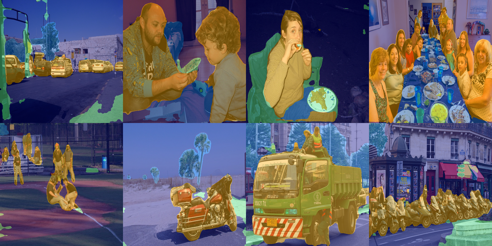

# Movability Segmentation

ELEG5491 course project, May 2025. A modified DeepLabV3 model assigns each image pixel to one of four movability categories, which describe how objects typically move or can be moved. In the [course report](report-2.pdf), the model reached a best validation mIoU of 0.638 within 50 epochs and ran at 58 FPS.



Prediction overlays from Figure 5 of [the course report](report-2.pdf), after epoch 50. [Source record](assets/provenance.json).

| Class ID | Report category | Report examples |
|---|---|---|
| 0 | Not Movable | Buildings, landscape, plantation |
| 1 | Normally Stable | Furniture, appliances, street facilities |
| 2 | Inactively Mobile | Clothes, foods, small objects |
| 3 | Highly Mobile | People, vehicles, animals |

[The explicit mapping](src/label_mapping.json) lists all 256 entries of `src/lut_movability.npy` and agrees with every entry in the report's Appendix A. It numbers labels as COCO-Stuff's `labels.txt` does (0 = unlabeled, 1 = person, 182 = wood).

## Setup and checks

```bash
python -m pip install -r requirements.txt
python src/create_lut.py --check
python -m unittest discover -s tests -v
```

The tests run on synthetic masks and random CPU inputs. They cover LUT preservation, data pairing, ignored pixels, global mIoU, loss behaviour and output dimensions.

## Data

Put images and single-channel integer PNG masks in separate split folders, with matching file names:

```text
dataset/
  images/train/example.jpg
  annotations/train/example.png
  images/val/example.jpg
  annotations/val/example.png
```

The loader also accepts `train2017` and `val2017` folder names. `--mask-encoding` says what the mask values mean:

- `source`: COCO-Stuff label IDs, mapped through the LUT in `labels.txt` numbering. The official `stuffthingmaps` PNG masks store each ID minus 1 and use 255 for unlabeled, so add 1 to every value except 255 before training on them. If your masks use 0 for unlabeled, pass `--source-ignore-label 0`.
- `movability`: masks already contain IDs 0 to 3, so do not apply the LUT again.

By default the loader ignores source value 255; `--source-ignore-label none` applies every LUT entry as written. The loader rejects RGB colour masks and any image or mask without a partner. Images become RGB float tensors in `[0, 1]`, and images and masks are resized to 512 × 512 by default (bilinear for images, nearest-neighbour for masks).

## Training and inference

```bash
python src/train.py --data-root dataset --mask-encoding source --source-ignore-label 255
python src/infer.py --image test_image.jpg --weights checkpoints/best.pth --output result.png
```

Training starts from pretrained torchvision weights and downloads them if needed; `--no-pretrained` starts from random weights. Inference builds the model without downloading weights and loads the checkpoint you pass; train one with `train.py` first.

Use `--image-size HEIGHT WIDTH` to change the training resolution; the default is 512 × 512. Inference uses the size saved in the checkpoint, or 512 × 512 if the checkpoint has none, and its own `--image-size` overrides both.

`python plot/LossCurv.py --log-dir logs` plots `Loss/train` and `Loss/val` from the TensorBoard logs that `train.py` writes; `--tags` picks other scalars such as `mIoU/val`. Give each training run its own `--log-dir`.

The model output always matches the input size. Both loss terms leave out ignored pixels, and validation mIoU comes from one confusion matrix over the whole validation set.
